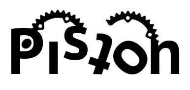
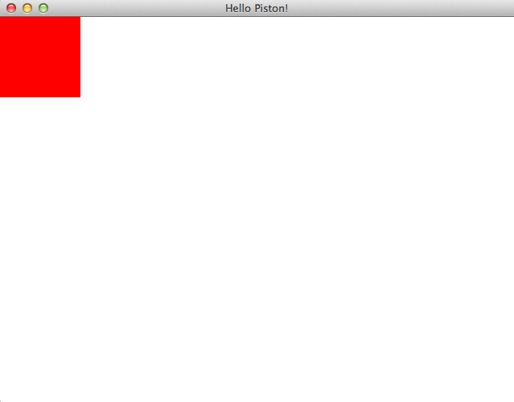
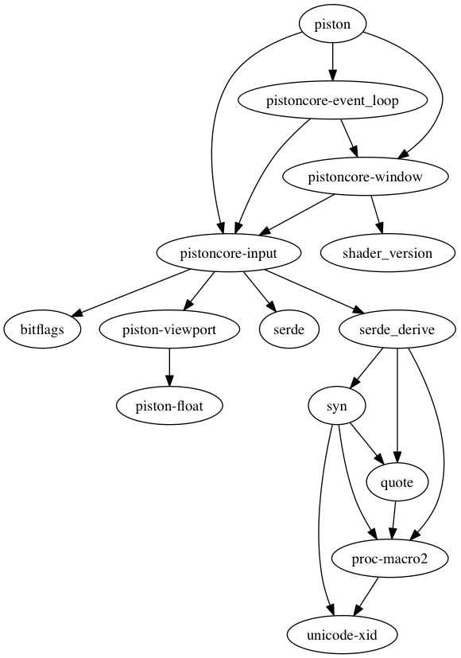

# 

[](https://travis-ci.org/PistonDevelopers/piston) [](https://crates.io/crates/piston) [](https://github.com/PistonDevelopers/piston/blob/master/LICENSE)

A modular game engine written in Rust

Maintainers of Piston core libraries: @bvssvni

## Dive into the world of Piston
* [Guide](./GUIDE.md)
* [Overview](https://github.com/PistonDevelopers/piston/wiki/Piston-overview)
* [Examples](https://github.com/pistondevelopers/piston-examples)
* [Tutorials](https://github.com/pistondevelopers/piston-tutorials)
* [Features](https://github.com/PistonDevelopers/piston/wiki/Features)
* [List of games made with Piston](https://github.com/PistonDevelopers/piston/wiki/Games-Made-With-Piston)
* [Piston online docs](https://docs.piston.rs/piston/piston/)
* [How to contribute](https://github.com/PistonDevelopers/piston/blob/master/CONTRIBUTING.md)
* [Discussion forum](http://discourse.piston.rs/)
* [Twitter - @PistonDeveloper](https://twitter.com/PistonDeveloper)
* [FAQ - Frequently Asked Questions](https://github.com/PistonDevelopers/piston/wiki/Frequently-Asked-Questions-(FAQ))

## Start new project with Piston

You should know how to build "hello world" with Rust, see http://www.rust-lang.org/.

### Drawing a red rectangle

**Note;** Being under active development, we use Rust nightly. If your compilation fails, try building with Rust nightly.

Add [piston_window](https://crates.io/crates/piston_window) to your Cargo.toml, for example:

```toml
[dependencies]
piston_window = "0.81.0"
```

In "src/main.rs", type the following code:

```Rust
extern crate piston_window;

use piston_window::*;

fn main() {
    let mut window: PistonWindow =
        WindowSettings::new("Hello Piston!", [640, 480])
        .exit_on_esc(true).build().unwrap();
    while let Some(event) = window.next() {
        window.draw_2d(&event, |context, graphics| {
            clear([1.0; 4], graphics);
            rectangle([1.0, 0.0, 0.0, 1.0], // red
                      [0.0, 0.0, 100.0, 100.0],
                      context.transform,
                      graphics);
        });
    }
}
```

Use `cargo run` to start the application. It should clear the screen in white color and draw a red rectangle.



## Goals

The Piston project is a large collaboration among many developers.
There are libraries for 2D, 3D, event programming, AI, image processing etc.
By sharing the maintenance, we get more time to build new stuff.

Piston is as much a community project as it is a collection of libraries.
Writing and maintaining code is expensive, and by sharing this cost we reach our goals faster.
We believe that seeking personal goals and ambitions, while helping each other, results in higher quality.

* Our main goal is to free up time for maintainers and the people involved
* ... such that we can create new amazing stuff and reach our personal goals
* ... by making more people use Rust for game development and become engaged in open source

In addition we do research or plan to in the following areas:

* Graphics, [2D](https://github.com/PistonDevelopers/graphics/) and 3D
* [GUI](https://github.com/PistonDevelopers/conrod/)
* Idiomatic Rust game design
* Interactive applications
* [AI programming](https://github.com/pistondevelopers/ai_behavior)
* Animation, [2D](https://github.com/PistonDevelopers/sprite) and [3D](https://github.com/PistonDevelopers/skeletal_animation)
* [Sound and music](https://github.com/PistonDevelopers/music)
* Network

### Dependency graph


